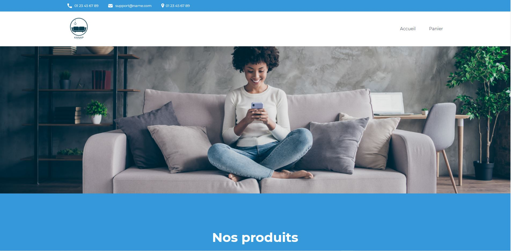

# Kanap #

Kanap est un site type e-commerce de vente de canapés.

Projet 5 De la formation, ici il faut connecter avec du javascript vanilla l'intégration html/css à l'api backend. 
Le client voit la liste des produits, sélectionne son ou ses modèles et les ajoutent à son panier. 
Sur son panier, le client peut choisr de modifier le contenu de celui-ci (quantité de produits, suppression) ensuite il peut valider sa commande en remplissant un formulaire, une fois celui-ci validé, le client voit apparaître un message de confirmation de commande avec un numéro de commande unique

### Prérequis et lancement ###

Pour lancer le backend, il est nécessaire d'avoir Node d'installé sur votre ordinateur et de lancer l'installation des dépendances via la commande "npm install"
Le serveur doit fonctionner sur `localhost` avec le port par défaut `3000`. 

